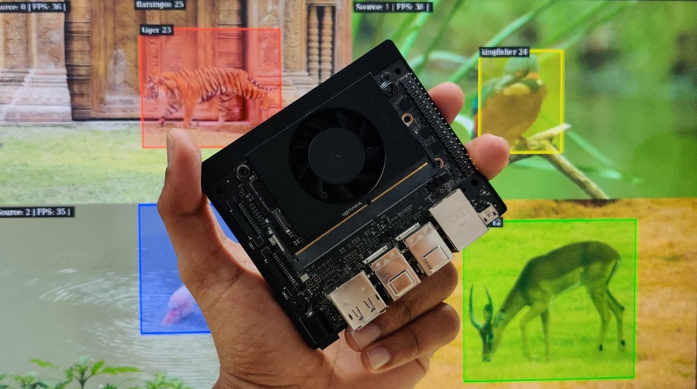

# Wild-Life-Photography App
Capture wildlife photos using the DeepLearning Model. Analyzing the wild species present in the Forest can be automated.


## Citations

* [AlexeyAB/darknet](https://github.com/AlexeyAB/darknet)
* [aj-ames/Hermes-Deepstream](https://github.com/aj-ames/Hermes-Deepstream)

## Index

1. [Introduction](#Introduction)
2. [Deepstream Setup](#Deepstream-Setup)
    1. [Install System Dependencies](#Install-System-Dependencies)
    2. [Install Deepstream](#Install-Deepstream)
3. [Data Set Preparation](#Dataset)
4. [Run Inference for Different Species](#Inference)

## Introduction
Capture Application will detect 4 different species of wildlife animals and birds.



This project is a proof-of-concept, trying to show that wildlife photography can be done with an onboard Jetson platform.

## Deepstream Setup

This post assumes you have a fully functional Jetson device. If not, you can refer to the documentation [here](https://docs.nvidia.com/jetson/jetpack/install-jetpack/index.html).

### 1. Install System Dependencies

```sh
sudo apt install \
libssl1.0.0 \
libgstreamer1.0-0 \
gstreamer1.0-tools \
gstreamer1.0-plugins-good \
gstreamer1.0-plugins-bad \
gstreamer1.0-plugins-ugly \
gstreamer1.0-libav \
libgstrtspserver-1.0-0 \
libjansson4=2.11-1
```

### 2. Install Deepstream

Download the DeepStream 5.0.1 Jetson Debian package `deepstream-5.0_5.0.1-1_arm64.deb`, to the Jetson device from [here](https://developer.nvidia.com/assets/Deepstream/5.0/ga/secure/deepstream_sdk_5.0.1_amd64.deb). Then enter the command:

```sh
sudo apt-get install ./deepstream-5.0_5.0.1-1_arm64.deb
```
## 3. Data Set Preparation

4 different classes used in this project 
1. Tiger
2. Gazelle
3. Flamingos
4. Kingfisher

## Running the Application

### 1. Clone the repository

This is a straightforward step, however, if you are new to git or git-lfs, I recommend glancing threw the steps.

First, install git and git-lfs

```sh
sudo apt install git git-lfs
```

Next, clone the repository

```sh
# Using HTTPS
git clone https://github.com/nihal601/Wild-Life-Photography.git
# Using SSH
git clone git@github.com:nihal601/Wild-Life-Photography.git
```

Finally, enable lfs and pull the yolo weights

```sh
git lfs install
git lfs pull
```

### 2. Run with different input sources

The computer vision part of the solution can be run on one or many input sources of multiple types, all powered using NVIDIA Deepstream.

First, build the application by running the following command:

```sh
make clean && make -j$(nproc)
```

This will generate the binary called `Capture-app`. This is a one-time step and you need to do this only when you make source-code changes.

Next, create a file called `inputsources.txt` and paste the path of videos or rtsp url.

```sh
file:////home/nihal/AI_Jetson/dataset/wildlife.avi
```

Now, run the application by running the following command:

```sh
./Capture-app
```